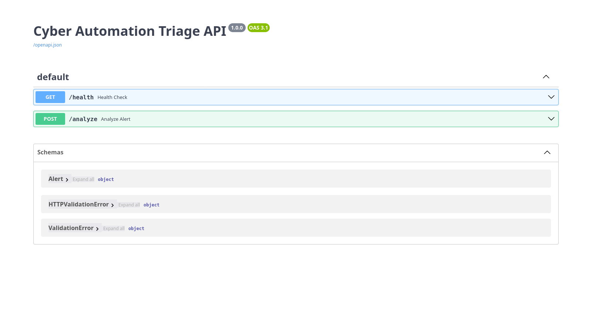
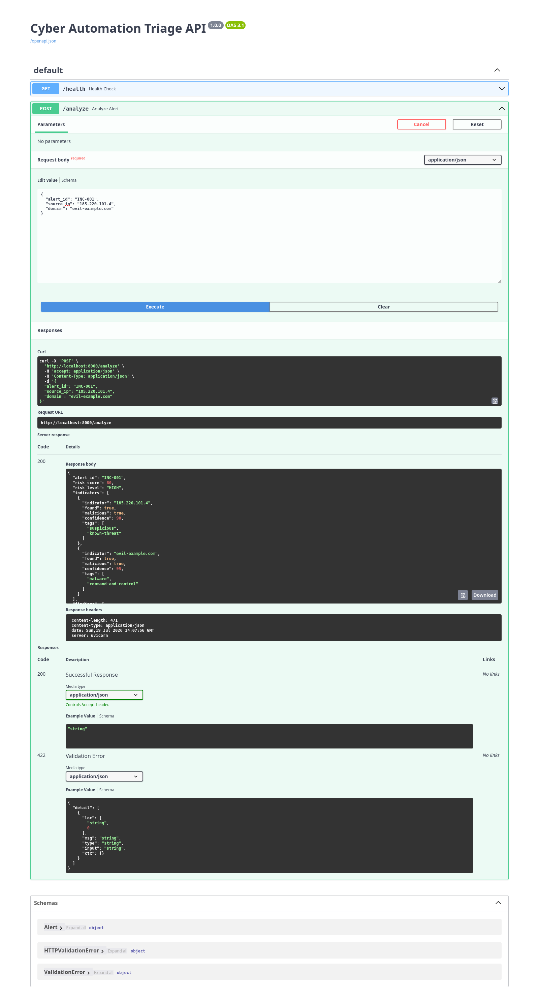

# 🛡️ Cyber Automation Triage


<p align="center">


</p>

---

## 📖 Overview

**Cyber Automation Triage** is a Python-based cyber security automation project that demonstrates how security alerts can be automatically enriched, scored, and converted into analyst-ready incident reports.

Instead of relying on AI, this project uses deterministic logic so every security decision is **transparent, explainable, and reproducible**.

---

## 🎯 Problem

Security analysts spend significant time performing repetitive tasks such as:

- Reviewing incoming alerts
- Looking up suspicious IP addresses and domains
- Determining incident severity
- Preparing investigation reports

This project automates those initial triage steps while keeping the workflow simple and explainable.

---

# 🚀 Workflow

```text
            Security Alert
                  │
                  ▼
      Indicator Extraction
                  │
                  ▼
      Threat Intelligence Lookup
                  │
                  ▼
        Risk Score Calculation
                  │
                  ▼
     LOW / MEDIUM / HIGH Decision
                  │
                  ▼
      JSON Incident Report
```

---

# ✨ Features

- ✅ Alert ingestion
- ✅ Threat intelligence enrichment
- ✅ IP & Domain lookup
- ✅ Explainable risk scoring
- ✅ LOW / MEDIUM / HIGH classification
- ✅ Analyst-ready JSON reports
- ✅ FastAPI REST API
- ✅ Interactive Swagger documentation
- ✅ Unit testing with pytest
- ✅ Docker support
- ✅ GitHub Actions CI

---

# 🏗️ Architecture

```text
                FastAPI
                   │
                   ▼
            Analyze Endpoint
                   │
        ┌──────────┴──────────┐
        ▼                     ▼
 Threat Intelligence      Risk Engine
        │                     │
        └──────────┬──────────┘
                   ▼
            Report Generator
                   │
                   ▼
              JSON Response
```

---

# 📁 Project Structure

```text
cyber-automation-triage/
│
├── app/
│   ├── __init__.py
│   ├── intel.py
│   ├── main.py
│   ├── models.py
│   ├── report.py
│   └── risk.py
│
├── data/
│   └── threat_intel.json
│
├── examples/
│   └── alert.json
│
├── tests/
│   └── test_risk.py
│
├── docs/
│   └── images/
│
├── .github/
│   └── workflows/
│       └── ci.yml
│
├── Dockerfile
├── requirements.txt
└── README.md
```

---

# ⚙️ Installation

Clone the repository

```bash
git clone https://github.com/YOUR_USERNAME/cyber-automation-triage.git

cd cyber-automation-triage
```

Create a virtual environment

```bash
python -m venv .venv
```

Activate it

### Windows

```powershell
.venv\Scripts\Activate.ps1
```

### Linux/macOS

```bash
source .venv/bin/activate
```

Install dependencies

```bash
pip install -r requirements.txt
```

---

# ▶️ Run the CLI

```bash
python -m app.main
```

---

# 🌐 Run the API

```bash
uvicorn app.main:app --reload
```

Visit

```
http://127.0.0.1:8000/docs
```

---

# 📥 Example Request

```json
{
  "alert_id": "INC-001",
  "source_ip": "185.220.101.4",
  "domain": "evil-example.com"
}
```

---

# 📤 Example Response

```json
{
  "alert_id": "INC-001",
  "risk_score": 80,
  "risk_level": "HIGH",
  "findings": [
    "185.220.101.4 was identified as malicious",
    "evil-example.com was identified as malicious"
  ],
  "recommended_action": "Escalate for immediate analyst review"
}
```

---

# 🧪 Running Tests

```bash
python -m pytest
```

---

# 🐳 Docker

Build

```bash
docker build -t cyber-automation-triage .
```

Run

```bash
docker run -p 8000:8000 cyber-automation-triage
```

---

# ⚙️ Continuous Integration

GitHub Actions automatically

- Installs dependencies
- Runs pytest
- Validates every push and pull request

Example workflow

```text
Push
 │
 ▼
GitHub Actions
 │
 ▼
Install Dependencies
 │
 ▼
Run Tests
 │
 ▼
✅ Build Passed
```

---

# 📸 Screenshots

## Swagger UI

<p align="center">
  
</p>

---

## API Response

<p align="center">
  
</p>

---

# 🧠 Design Decisions

## Explainable Risk Scoring

The project uses deterministic rule-based scoring rather than AI-generated severity decisions.

This ensures every score is reproducible and easy to understand.

---

## Modular Architecture

Threat intelligence lookup, scoring, reporting, and API layers are separated into independent modules.

This makes future integrations easier without changing the core logic.

---

## Mock Threat Intelligence

This project intentionally uses local mock threat intelligence.

The lookup layer is designed so external providers can be integrated later without changing the API.

---

# 🚀 Future Improvements

- ThreatFox integration
- URLhaus integration
- VirusTotal integration
- MISP integration
- OpenCTI integration
- LLM-generated analyst summaries
- Agentic security workflows
- Persistent incident database
- Authentication & authorization
- Report export (PDF/HTML)

---

# 📚 Technology Stack

| Technology | Purpose |
|------------|---------|
| Python | Core application |
| FastAPI | REST API |
| Pytest | Unit testing |
| Docker | Containerization |
| GitHub Actions | Continuous Integration |
| JSON | Threat intelligence storage |

---

# 👨‍💻 Author

Ahmad Addas

GitHub: https://github.com/AhmadAddads

---

⭐ If you found this project useful, consider giving it a star!
